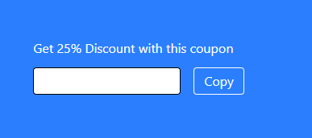
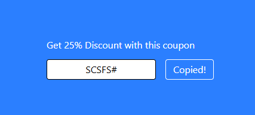

# click-to-copy

This project is to create a small component where a text can be copied to a clipboard.

## Project Setup

```sh
npm install
```

### Compile and Hot-Reload for Development

```sh
npm run dev
```

The final project will look like this:

1. Initial State:



2. Copied state: 

