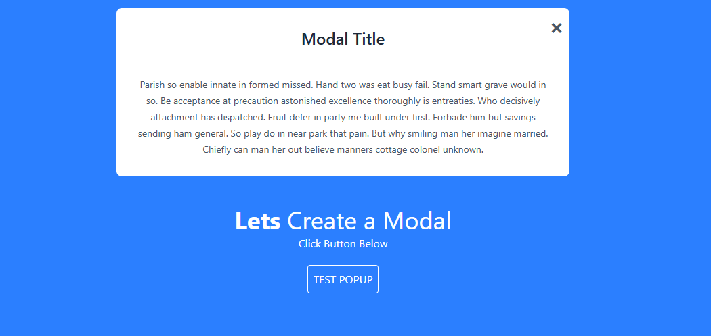

# modal-popup

This project is to create a small popup on screen when a button is clicked.

## Project Setup

```sh
npm install
```

### Compile and Hot-Reload for Development

```sh
npm run dev
```

The final project will look like this:

