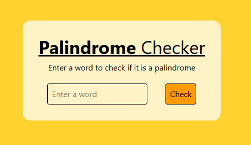
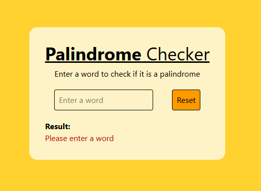
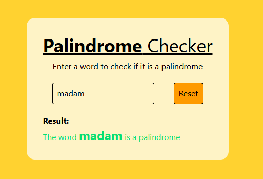
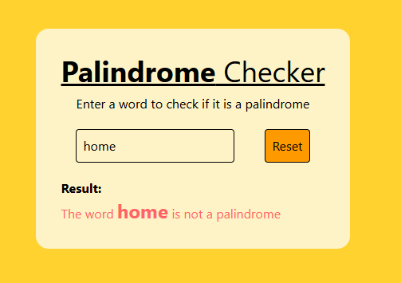

# Palindrome checker

This project is to create a palindrome checker.

## Project Setup

```sh
npm install
```

### Compile and Hot-Reload for Development

```sh
npm run dev
```

The final project will look like this:

Initial State:



When no Input is provided and tried to check:



When a palindrome string is provided:



When a non-palindrome string is provided:

